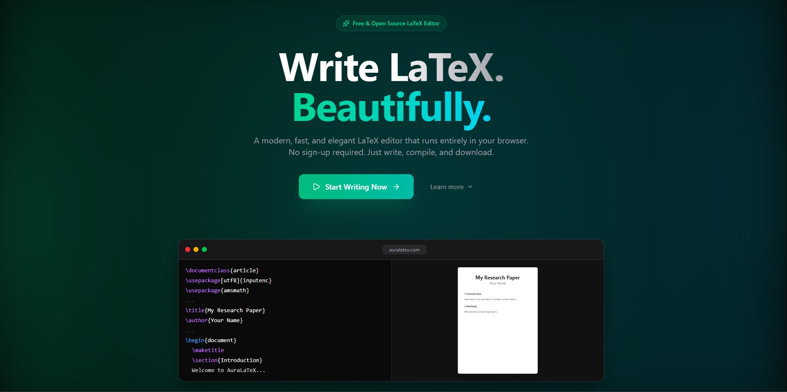

# AuraLaTeX [](https://github.com/HassanAli/AuraLaTeX) [](https://opensource.org/licenses/MIT) [](https://github.com/HassanAli/AuraLaTeX/commits/main) [](https://github.com/HassanAli/AuraLaTeX/stargazers) [](https://github.com/HassanAli/AuraLaTeX/actions)

A professional, AI-powered LaTeX editor and compiler built for high-performance scientific writing on the web.

## Demo / Screenshot


## Table of Contents
1. [Project Title & Badges](#auralatex)
2. [One-Line Description](#one-line-description)
3. [Demo / Screenshot](#demo--screenshot)
4. [Table of Contents](#table-of-contents)
5. [Features](#features)
6. [Tech Stack](#tech-stack)
7. [Prerequisites](#prerequisites)
8. [Installation](#installation)
9. [Environment Variables](#environment-variables)
10. [Usage / Quickstart](#usage--quickstart)
11. [API Reference](#api-reference)
12. [Project Structure](#project-structure)
13. [Contributing](#contributing)
14. [Running Tests](#running-tests)
15. [Deployment](#deployment)
16. [Roadmap](#roadmap)
17. [License](#license)
18. [Author & Contact](#author--contact)

## Features
*   **Instant Compilation**: Process complex LaTeX documents in milliseconds via Edge-native API proxying.
*   **Side-by-Side Preview**: Synchronized live PDF viewer with adjustable split-pane editor interface.
*   **Template Library**: One-click access to professional templates for articles, reports, and resumes.
*   **Responsive Workspace**: Fluid layout optimization for desktop, tablet, and mobile devices.
*   **Edge-Native Architecture**: Powered by Cloudflare Pages Functions for ultra-low latency compilation.
*   **Smart Exports**: Seamlessly download documents as raw `.tex` source or production-ready `.pdf`.
*   **Modern Theming**: Fully integrated Dark and Light modes with system-preference synchronization.

## Tech Stack
| Technology | Version | Purpose |
| :--- | :--- | :--- |
| React | 19.2.0 | Frontend UI Framework |
| TypeScript | 5.9.3 | Static Type Checking |
| Vite | 7.3.1 | Build Orchestration |
| Tailwind CSS | 4.2.1 | UI Styling & Design System |
| Framer Motion | 12.35.0 | Interaction Animations |
| Cloudflare Pages | Latest | Deployment & API Runtime |
| Lucide React | 0.577.0 | Vector Icon Suite |

## Prerequisites
1.  Node.js (Version 18.0.0 or higher)
2.  npm (Version 9.0.0 or higher) or pnpm
3.  Cloudflare Wrangler (for local API testing)

## Installation
1.  **Clone the repository**
    ```bash
    git clone https://github.com/HassanAli/AuraLaTeX.git
    cd AuraLaTeX
    ```

2.  **Install dependencies**
    ```bash
    npm install
    ```

3.  **Configure environment**
    ```bash
    cp .env.example .env
    ```

4.  **Run development server**
    ```bash
    npm run dev
    ```

## Environment Variables
| Variable | Required | Description | Example |
| :--- | :--- | :--- | :--- |
| `NODE_ENV` | No | Current environment | `development` |
| `LATEX_API_URL` | No | External compiler endpoint | `https://latex.ytotech.com/builds/sync` |

*Note: The project is pre-configured to work with a public compiler API by default.*

## Usage / Quickstart
1.  Navigate to `localhost:5173`.
2.  Click **"Get Started"** to enter the editor.
3.  Write your LaTeX code in the left panel.
4.  Press `Ctrl + Enter` or click **"Compile"** in the header.
5.  View the real-time PDF result in the preview panel.

```latex
\documentclass{article}
\begin{document}
Hello from AuraLaTeX!
\end{document}
```

## API Reference
| Method | Route | Description | Auth |
| :--- | :--- | :--- | :--- |
| `POST` | `/api/compile` | Compiles raw LaTeX string into a Base64 PDF string. | None |

**Payload:**
```json
{
  "content": "\\documentclass{article}\\begin{document}Hello\\end{document}"
}
```

## Project Structure
```text
AuraLaTeX/
├── functions/          # Cloudflare Pages Functions (API Handlers)
│   └── api/            # API endpoints for compilation
├── public/             # Static assets (logos, images)
├── src/                # React frontend source code
│   ├── components/     # UI components and layouts
│   ├── types/          # TypeScript interface definitions
│   └── lib/            # Shared utilities and hooks
└── wrangler.toml       # Cloudflare Pages configuration
```

## Contributing
1.  **Fork** the project.
2.  **Create** a feature branch: `git checkout -b feature/amazing-feature`.
3.  **Commit** your changes: `git commit -m 'Add amazing feature'`.
4.  **Push** to the branch: `git push origin feature/amazing-feature`.
5.  **Open** a Pull Request.

**Naming Convention**: `feature/`, `fix/`, or `docs/` prefixes required.
**Commit Style**: Use [Conventional Commits](https://www.conventionalcommits.org/).

## Running Tests
```bash
npm run lint
```
*   **Linting**: ESLint checks for code style and potential errors.
*   **Type Safety**: TypeScript compiler validates internal logic consistency.
*   *Note: Unit tests coming soon.*

## Deployment
1.  **Build the application**
    ```bash
    npm run build
    ```
2.  **Deploy to Cloudflare Pages**
    - Connect your GitHub repository to the Cloudflare Dashboard.
    - Set Build Command: `npm run build`
    - Set Build Output Directory: `dist`
    - Enable **Compatibility Flag**: `nodejs_compat`

## Roadmap
- [ ] **Real-time Collaboration** — Multiple users editing the same document simultaneously.
- [ ] **AI Writing Assistant** — Integrated LLM for LaTeX snippet generation and error correction.
- [ ] **Advanced Bibliography** — BibTeX integration with automatic citation formatting.
- [ ] **Cloud Storage** — Persistent user profiles with project auto-save functionality.

## License
License type: **MIT**

Free to use, modify, and distribute. See [LICENSE](LICENSE) for details.

## Author & Contact
- **Name**: Hassan Ali
- **Site**: [hassanali.site](https://hassanali.site)
- **GitHub**: [github.com/HassanAli](https://github.com/HassanAli)

Found a bug? Open an issue. Want to collab? DM me.
